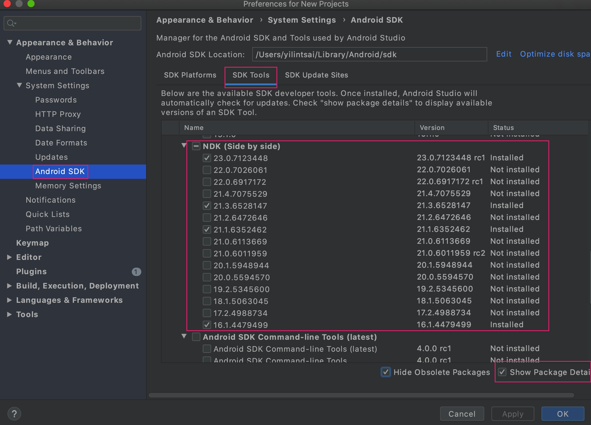

# NDK 環境參數配置
以 zsh 終端機為例修改新增環境參數 `.zshrc`。Mac 內建的終端機可以修改 `.bash_profile`。

## 1.打開終端輸入

```bash
open .zshrc
```

## 2. 新增 NDK 環境參數
可以到 Android 官網下載 [NDK](https://developer.android.com/ndk/downloads)，若要下載舊版可以到[這裡](https://developer.android.com/ndk/downloads/older_releases)。如果有 Android Studio 的讀者可以開啟後 `Tools -> SDK Manager` 來下載指定版本。下面範例路徑是由 Android Studio 下載 NDK 的預設路徑。我這裡是下載舊版的 16.1。



```bash
export NDK_ROOT=/Users/userName/Library/Android/sdk/ndk/16.1.4479499
export PATH=$PATH:$NDK_ROOT
```

> 路徑中的 `userName` 記得替換成系統User名稱