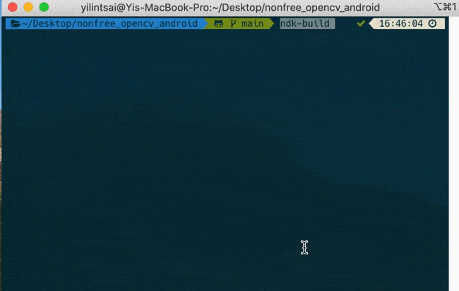
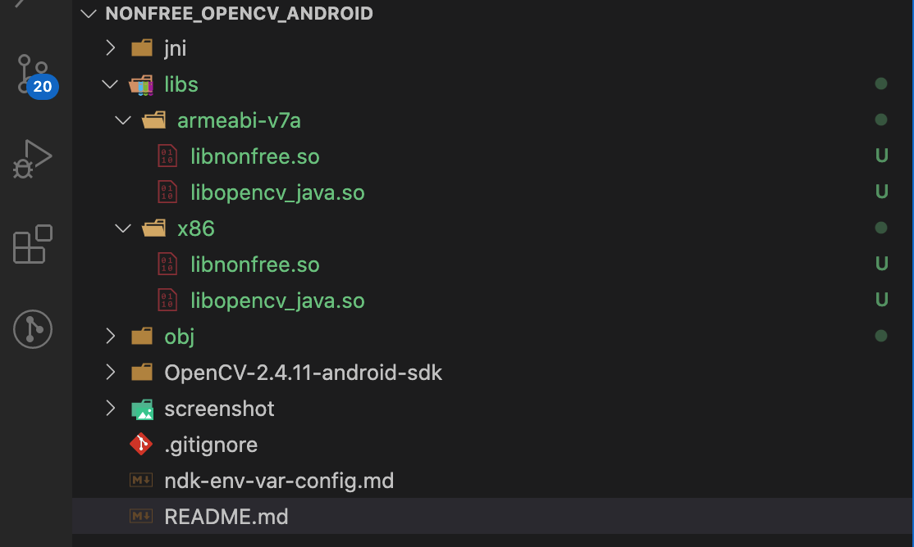

# nonfree_opencv_android
This repo talks about how to use Nonfree module of OpenCV (SURF and SIFT) with Android JNI and NDK. This tutorial will show you a quick way to build your nonfree module (SIFT and SURF) in OpenCV for Android NDK project. You can follow this tutorial to set up your own project.

development environment is set up as follows:
```
- macOS Catalina
- Android ndk 16.1.4479499
- OpenCV-2.4.11-android-sdk
```

## How to build?
We will first build libnonfree.so, and then show how to use it to build an Android native application.

### Step 1: create project, prepare files needed.
資料夾會有以下內容。其中 `OpenCV-2.4.11-android-sdk` 可以從 OpenCV [官網](https://opencv.org/releases/)下載。至於為何要下載舊版 SDK 由於舊版 OpenCV 在早期 SIFT 和 SURF 因專利專系並未釋出，必須透過 nonffree 來存取。但是在 2020 SIFT 的專利已過期，使得 OpenCV 4.4.0 釋出 SIFT演算法並已移至主儲存庫的資料夾中。

```
.
├── OpenCV-2.4.11-android-sdk
├── README.md
└── jni
   ├── Android.mk
   ├── Application.mk
   ├── nonfree_init.cpp
   ├── precomp.hpp
   ├── sift.cpp
   └── surf.cpp
```

剛有提到因專利法關係在 OpenCV 4.4.0 之前版本是無法直接使用 SIFT 和 SURF 類的演算法。因此這裏採用 `OpenCV-2.4.11` 示範。如果是自己另外從官網下載的SDK，必須要在 `OpenCV-2.4.11-android-sdk\sdk\native\jni\include\opencv2\` 中加入 `nonfree` 資料夾，並加上 `features2d.hpp`、`nonfree.hpp`這兩隻檔案。在這 repo 中我已經幫大家[上傳](https://github.com/andy6804tw/nonfree_opencv_android/tree/main/OpenCV-2.4.11-android-sdk/sdk/native/jni/include/opencv2/nonfree)好了(也是這個repo肥大的幫兇)。

## Step 2: Create jni folder
在主目錄下新增 `jni` 資料夾。並新增 `nonfree_init.cpp, precomp.hpp, sift.cpp, surf.cpp`。

## Step 3: create `Android.mk` & `Application.mk` file
建立 `Android.mk` 和 `Application.mk`：

首先建立 `Application.mk`。在這支檔案內需要在 `APP_ABI` 標記要轉譯出的CPU類型，常見通常都需要這兩個 `armeabi-v7a`、`x86`。前者是現在手機目前主流架構 `arm7`，後者是給開發者在模擬器上除錯執行用。

直到目前為止，Android 共有7種不同的 cpu 分別為 ARMv5，ARMv7（從2010年起）x86（從2011年起）MIPS（從2012年起）ARMv8，MIPS64 和 x86_64（從2014年起）。為了支援這些 cup 我們就需要包相對應的 so 檔進 apk 裡。

```
# Application.mk
APP_ABI := armeabi-v7a x86
APP_STL := gnustl_static
APP_CPPFLAGS := -frtti -fexceptions
APP_PLATFORM := android-15
```

這邊要給指定版的的 OpenCV SDK `OpenCV.mk`，以及 `LOCAL_C_INCLUDES` 函式庫。 `LOCAL_SRC_FILES` 即為 jni 資料夾下欲被編譯的 C++ 程式。

```
# Android.mk
LOCAL_PATH:= $(call my-dir)
include $(CLEAR_VARS)
OPENCV_INSTALL_MODULES:=on
OPENCV_CAMERA_MODULES:=off
include ./OpenCV-2.4.11-android-sdk/sdk/native/jni/OpenCV.mk

LOCAL_C_INCLUDES:= ./OpenCV-2.4.11-android-sdk/sdk/native/jni/include
LOCAL_MODULE    := nonfree
LOCAL_CFLAGS    := -Werror -O3 -ffast-math
LOCAL_LDLIBS    += -llog
LOCAL_SRC_FILES := nonfree_init.cpp sift.cpp surf.cpp
include $(BUILD_SHARED_LIBRARY)
```

## Step 4: build libnonfree.so
cd 進入主目錄 `nonfree_opencv_android` 資料夾後，執行 `ndk-build` 指令來產生 `libnonfree.so`。



執行成功後可以發現多了 `libs` 和 `obj` 資料夾。裡面將會有相對應的 CPU 架構的 `libnonfree.so` 與 `libopencv_java.so`


You can easily build any SIFT or SURF applications using those libraries. If you want to use SIFT and SURF in JAVA code in your Android application, you only need to write JNI interfaces for the functions you want to use. you could also use JAVA code to call these functions, just as you did for other modules in OpenCV. Thanks ArthurT for the comments:

```
"Thank you very much for all the detailed explanation. Maybe what you would need to state more clearly is that for people only wanting to use SIFT and/or SURF via Java without caring about the JNI side (as I did), they need to copy-paste libnonfree.so and libopencv_java.so into their jniLibs folder under the relevant architecture folder (armeabi, armeabi-v7a, mips or x86). libopencv_java needs to be replaced if it is already in the folder(s). After this, static library loading with: System.loadLibrary("opencv_java"); System.loadLibrary("nonfree"); simply works and the job is done."
```

# Reference
Thanks Guohui Wang's blog posts.
- [Tutorial - part 1: Using OpenCV Nonfree Module (SIFT, SURF) in Android NDK Projects](http://web.guohuiwang.com/technical-notes/sift_surf_opencv_android?spm=a2c4e.10696291.0.0.76b719a4BdmPDn)